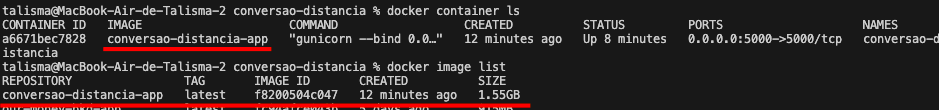
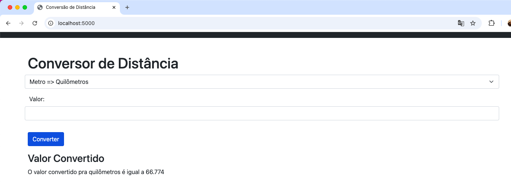

# conversao-distancia

- [x] Gere uma imagem Docker a partir do Dockerfile criado.
- [x] Execute um contêiner a partir da imagem para garantir que a aplicação esteja acessível na porta 5000.
    

- [x] Realize testes básicos na aplicação para verificar a funcionalidade de conversão de métricas.
    